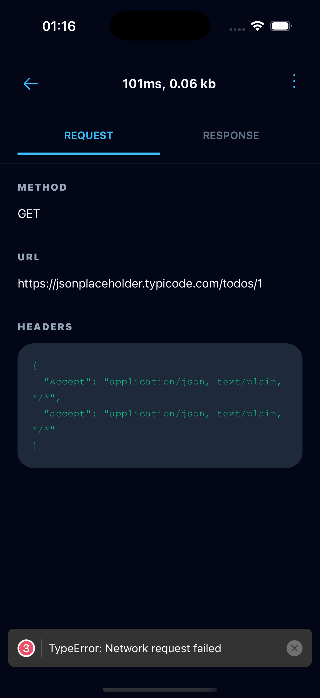
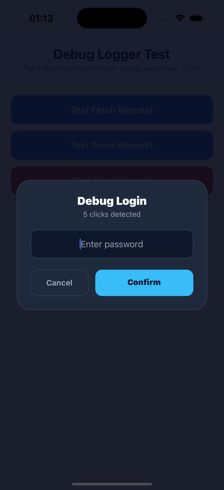
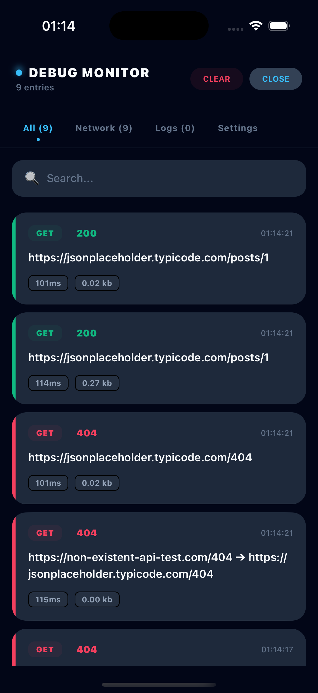
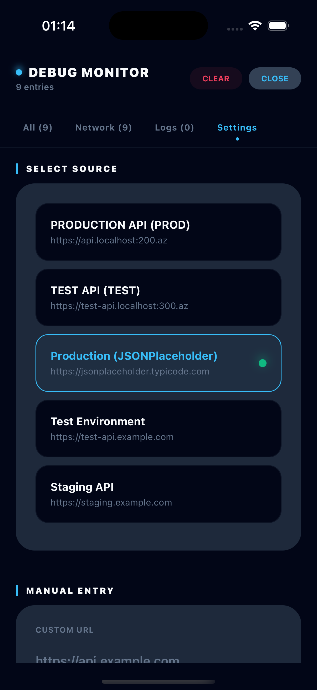

# 🚀 react-native-debug-logger

**Production-Ready Network Monitor & Debug Tool for React Native**

[](https://www.npmjs.com/package/react-native-debug-logger)
[](https://github.com/alicanov98/react-native-debug-logger/blob/main/LICENSE)
[](https://reactnative.dev/)

A powerful network debugger and logger for React Native that works even in **production builds**.

Capture network requests, console logs, and dynamically switch API environments — all inside your app with a modern hidden UI.

---

## 👀 Preview

<p align="center">
  
  
  
  
</p>

---

## ✨ Features

### 🌐 Network Monitoring

* Intercepts `fetch` and `XMLHttpRequest`
* Optional `Axios` support
* Full request/response inspection
* Duration, headers, payload tracking

### 🔄 Dynamic Environment Switching

* Change API Base URL at runtime
* Supports Production / Staging / Test / Custom
* No rebuild required
* Smart redirection engine

### 🕵️ Hidden Debug Access

* Multi-tap trigger system
* Works anywhere in the app
* Invisible for end-users

### 🔐 Security Layer

* Password-protected access
* Role-based enable/disable logic
* Safe for production usage

### 🎨 Premium UI

* Glassmorphism design
* Dark mode optimized
* Smooth animations
* Floating debug button

### 🔍 Filtering & Search

* Filter by:
  * Request
  * Response
  * Error
* Search by URL or content

### 📤 Export & cURL

* Copy requests as executable cURL
* Export logs via share sheet

### 🌍 Localization

* Auto-detect device language
* Supports: AZ, EN, TR, RU

---

## ⚡ Quick Start (1-Minute Setup)

Wrap your app. That’s it.

```tsx
import { DebugTrigger } from 'react-native-debug-logger';

const App = () => {
  return (
    <DebugTrigger 
      password="2025"
      clicksNeeded={5}
      prodUrl="https://api.myapp.com"
      testUrl="https://test-api.myapp.com"
    >
      <YourAppRoot />
    </DebugTrigger>
  );
};
```

✔ No config
✔ Works instantly
✔ Works in Release builds

---

## 🧠 Deep Dive: Architecture

This library is built around **3 core pillars**:

### 1. Logger (Core Engine)

* Singleton pattern
* Centralized log storage
* Handles all incoming events

### 2. Monitors (Interceptors)

* Patches:
  * `fetch`
  * `XMLHttpRequest`
  * `console`
* Captures and forwards all activity to Logger

### 3. UI Layer

* `DebugTrigger` → hidden entry point
* `DebugMonitor` → full dashboard

---

## 🌐 Network Layer Explained

* Uses **global patching**
* Does NOT block original requests
* Clones request/response safely

Captured data:
* URL
* Method
* Headers
* Body
* Status
* Duration

---

## 🔁 Smart Redirection Engine

Example:
```
https://api.prod.com/users
➡️ https://api.test.com/users
```
✔ Happens before request is sent
✔ Transparent to your app

### 🧠 Smart Exclusions

Internal dev traffic like `localhost:8081` is automatically ignored to prevent conflicts.

---

## 🕵️ DebugTrigger System

* Detects multiple taps (`clicksNeeded`)
* Opens password modal
* Activates debug session

After activation:
* Floating **DEBUG** button appears
* Quick re-access enabled

---

## 🖥 Debug Monitor Dashboard

### Tabs

* **All** → everything
* **Network** → API logs
* **Logs** → console output
* **Settings** → environment control

### Extra Capabilities

* URL redirection indicator
* Real-time updates
* Clean cURL generation

---

## ⚙️ State & Performance

* No Redux / MobX / external state libs
* Uses **Subscriber Pattern**
* Lightweight and fast

### Memory Control

* Max ~500 logs (configurable)
* Auto cleanup of old logs

---

## 🛠 Advanced Usage

### Custom Base URLs

```tsx
<DebugTrigger
  password="admin"
  clicksNeeded={7}
  baseUrls={[
    { title: 'Local', url: 'http://192.168.1.10:3000' },
    { title: 'Staging', url: 'https://staging.myapp.com' }
  ]}
  onBaseUrlChange={(url) => {
    console.log('New Base URL:', url);
  }}
>
  <App />
</DebugTrigger>
```

---

### Manual Logging API

```ts
import { Logger } from 'react-native-debug-logger';

Logger.logInfo('User action', { id: 1 });
Logger.logError('Something failed');
Logger.logNavigation('HomeScreen');
Logger.logDatabase('SELECT * FROM users');
```

---

## 🆚 Why react-native-debug-logger?

| Feature             | This Library | Others |
| ------------------- | ------------ | ------ |
| Works in Production | ✅            | ❌      |
| Built-in UI         | ✅            | ❌      |
| Zero dependencies   | ✅            | ❌      |
| API switching       | ✅            | ❌      |
| Hidden access       | ✅            | ❌      |

---

## 👥 Who is this for?

* React Native developers debugging APIs
* Teams working with multiple environments
* QA engineers testing builds
* Production debugging scenarios

---

## 🛡 Security Best Practice

Disable for normal users:

```tsx
const isEnabled = __DEV__ || isAdmin;

return isEnabled ? (
  <DebugTrigger>{children}</DebugTrigger>
) : children;
```

---

## 📦 Installation

```bash
npm install react-native-debug-logger
```

---

## 📚 Keywords

react-native, debug, logger, network, axios, fetch, interceptor, monitoring, devtools

---

## ❤️ Support

If you find this useful:
👉 [https://kofe.al/@alicanov98](https://kofe.al/@alicanov98)

---

## 👨💻 Author

**Alijanov**
[https://github.com/alicanov98](https://github.com/alicanov98)

---

## ⭐ Star the Repo

If you like this project, give it a ⭐ — it really helps!

---

## 📄 License

MIT License
